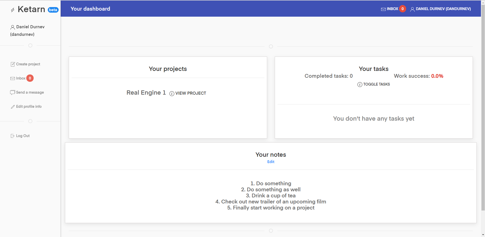
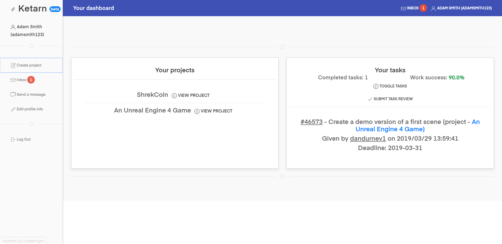
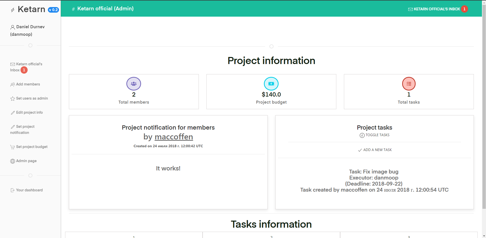
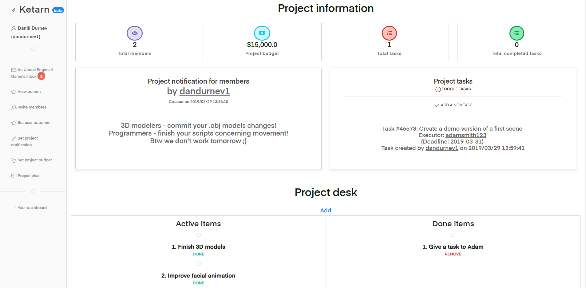
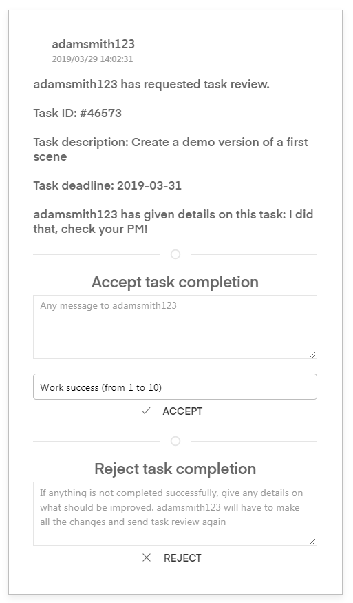

# Ketarn - project management system (Java, Spring, MongoDB)

[Open Ketarn App](https://ketarn.herokuapp.com).

Ketarn is used to manage your work within a team. If you are an admin, you can assign tasks, display notification and set your project budget. Every member has score - how well they are doing tasks assigned by project admins (from 0% to 100%).

The project uses **Thymeleaf** as a template render engine -> render data from server part to static html pages

If you want to build and launch it on your PC
address - http://localhost:1337/
MongoDB port - 27017

**Controller** folder contains all the logic: different responses to requests like registering user, adding project, comments, etc.

**Configuration** folder has the config class to make Spring Security work. When you are logged in, the principal stored in SecurityContextHolder. This way of doing security stuff is better than it was before when user object was stored in a modelAttribute

**Service** folder contains files that are responsible for saving and getting objects from database, also there is a file **MongoUserDetailsService** which is reponsible for linking Spring Security with MongoDB

**Model** folder contains files that represent objects of the app (which are stored in MongoDB). For example - user object, message, project, notification, task)

